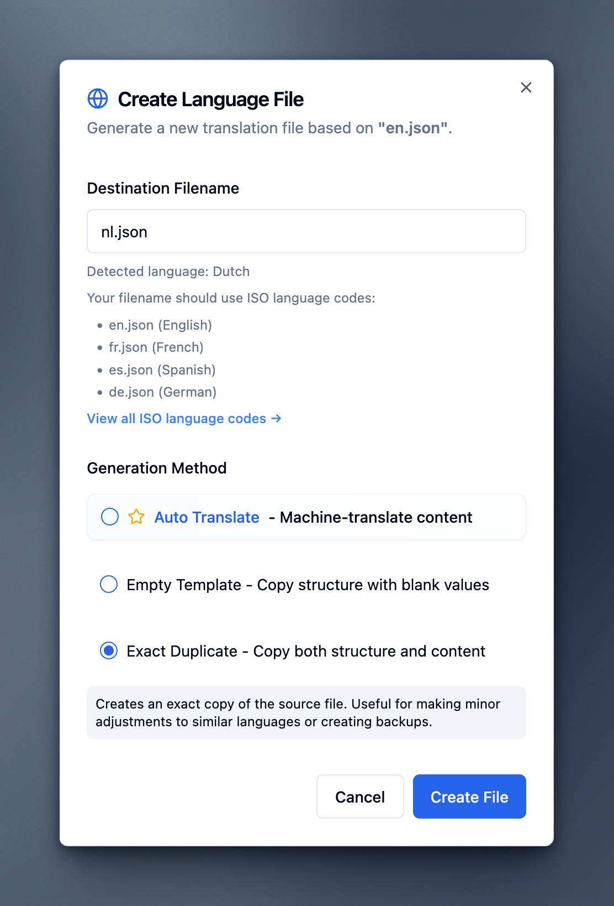

# Bikerouter Locales

This repository contains the localization files for [Bikerouter.de].

The translation strings are stored in JSON format and can be read and written by
many translation tools, e.g. Poedit or [Quick i18n
Studio].

`locales/en.json` is the canonical translation file which is and should be used as
template/reference file for all other translations.

## Updating a Translation

1. Clone the repository.
2. Create Git branch
3. Update a translation file (`locales/*.json`) with a tool of your choice, use `locales/en.json` as template/reference file.
4. Commit, push and create Pull Request
5. Thanks ❤️

## Adding a new Translation

1. Clone the repository.
2. Create Git branch
3. Add a translation file (`locales/*.json`), use `locales/en.json` as template/reference file.
4. Commit, push and create Pull Request
5. Thanks ❤️

## Using Quick i18n Studio

### Adding a New Translation

1. “Browse files”, upload `locales/en.json`
2. In the action menu (⋯) for the English translation select “Clone language”
3. Enter “Destination Filename”, e.g. `nl.json` and select “Exact Duplicate”

   

4. Click “Create File”
5. Translate strings
6. After translation, click “Export” in the action menu (⋯)
7. Put the downloaded  JSON file into the `locales/` directory and create a pull request.

### Updating a Translation

1. “Browse files”, upload `locales/en.json` and the other translation file, e.g. `/locales/de.json`.
2. Translate strings
3. After translation, click “Export” in the action menu (⋯)
4. Put the downloaded JSON file back into the `locales/` directory and create a pull request.

[Bikerouter.de]: https://bikerouter.de/
[Quick i18n Studio]: https://www.quicki18n.studio/
